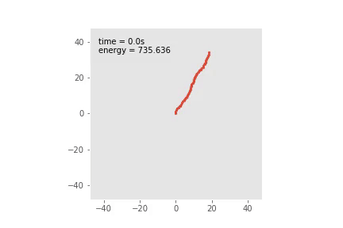

# Multi-Mass Pendulum Chain Dynamics Project

This project investigates the complex dynamics of a multi-mass pendulum chain, including chaos, quasi-periodic motion, and thermodynamic behavior in longer chains. It uses numerical simulations to study how these dynamics change with varying initial conditions and the number of pendulums.



## Project Structure


```
├── code
│ ├── pendulum.py # The main simulation code for the multi-mass pendulum system.
│ └── rk_base.py # Implementation of the Runge-Kutta method for numerical integration.
├── notebook.ipynb # Jupyter notebook with interactive simulations and results visualization.
├── project_report_pendulum.pdf # Detailed project report with findings and discussions.
└── teaser_pendulum.gif # Animated teaser showing a sample pendulum chain simulation.
```


### File Descriptions

- `README.md`: Provides an overview and instructions for the project.
- `code/pendulum.py`: Contains the simulation code for modeling the pendulum chain and its dynamics.
- `code/rk_base.py`: Houses the Runge-Kutta integrator used to solve the differential equations in the model.
- `notebook.ipynb`: An interactive Jupyter notebook that demonstrates the model with visualizations and allows for direct manipulation of parameters.
- `project_report_pendulum.pdf`: The comprehensive report that details the methodology, results, and conclusions of the study.
- `teaser_pendulum.gif`: A short animation that gives a visual introduction to the behavior of the multi-mass pendulum chain studied in this project.

## License

This project is licensed under the MIT License - see the [LICENSE](LICENSE) file for details.

---

For any additional information or inquiries, please contact the project maintainers.